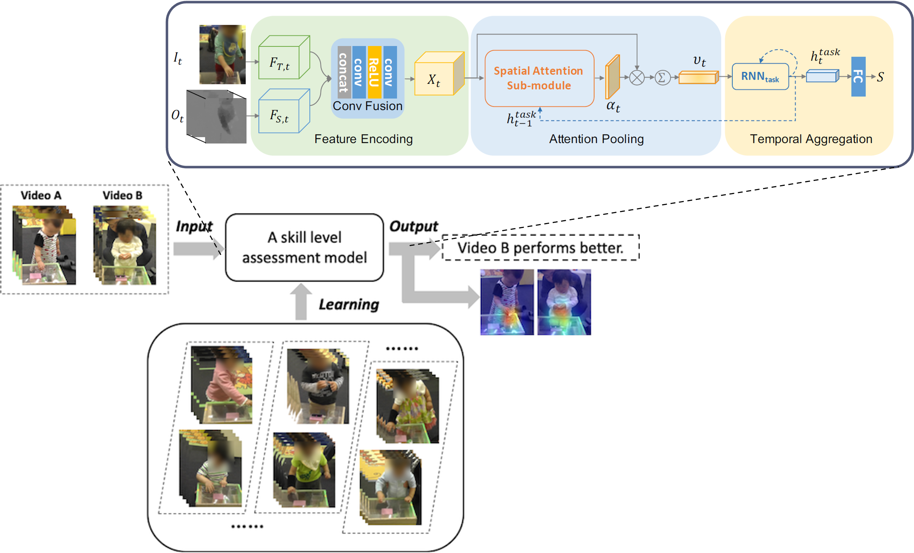
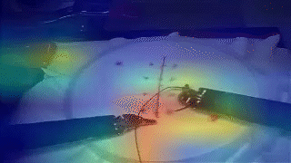
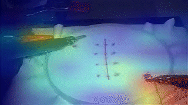
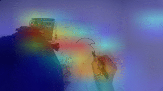
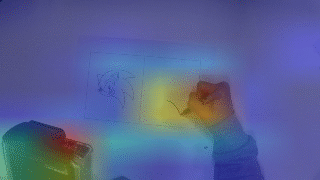

# Manipulation-Skill Assessment from Videos with Spatial Attention

Code for EPIC@ICCV2019 paper: Manipulation-skill assessment from videos with spatial attention network

## Introduction

Quatifying and ranking the action quality performed in videos by decaying the attention to the redundent background parts and modeling temporal relationships on key parts.



We proposed a novel RNN-based spatial attention model that considers accumulated attention state from previous frames as well as high-level information about the progress of an undergoing task.


|  | >    |  |
| --- | ---- | --- |
|  | >    |  |

The approach is validated on four existing datasets of hand manipulation tasks, including Surgery, Drawing, Cooking and Using Chopsticks.


## Reference

```
@inproceedings{li2019manipulation,
  title={Manipulation-skill assessment from videos with spatial attention network},
  author={Li, Zhenqiang and Huang, Yifei and Cai, Minjie and Sato, Yoichi},
  booktitle={Proceedings of the IEEE/CVF International Conference on Computer Vision Workshops},
  pages={0--0},
  year={2019}
}
```
